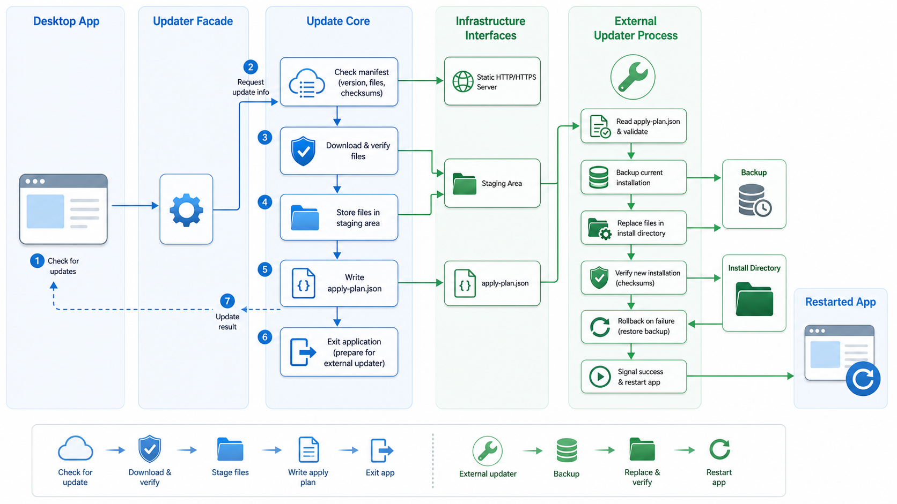

# libAutoUpdater

[](https://github.com/sorrowfeng/libAutoUpdater/actions/workflows/ci.yml)
[](https://github.com/sorrowfeng/libAutoUpdater/actions/workflows/codeql.yml)
[](https://github.com/sorrowfeng/libAutoUpdater/releases)
[](CMakeLists.txt)
[](LICENSE)

English | [Chinese](README.zh-CN.md)

`libAutoUpdater` is a C++17 online update library for desktop applications on Windows, macOS, and Linux. It checks static manifests, downloads only changed files, verifies every file, delegates replacement to an external updater process, and can roll back failed apply operations.

No custom update server is required. Release manifests and files can be hosted on any HTTP/HTTPS static file server, object storage bucket, CDN, or GitHub Raw endpoint.

## Highlights

- Static-file release hosting: no backend service to run.
- File-level incremental updates using SHA-256.
- Safe self-replacement through `autoupdater_apply`.
- Apply rollback after failed replacement or verification.
- Configurable detached manifest signatures, required by the production network policy.
- Anti-downgrade, bounded-expiry, and mandatory network URL-scope checks.
- Native HTTPS backends on Windows and macOS, with libcurl available everywhere.
- GUI-independent core with Qt and CLI examples.
- Testable interfaces for network, hashing, filesystem, signatures, process launch, dispatch, and state storage.

## Project Status

`libAutoUpdater` is currently in the `0.x` phase. The core architecture, updater executable, manifest tooling, examples, CI, and real update-flow tests are in place, but the public API and manifest schema should still be treated as pre-1.0 and may change between minor versions.

| Area | Status |
| --- | --- |
| Core check / plan / download / apply flow | Implemented |
| External updater process | Implemented |
| Rollback and update lock | Implemented |
| Manifest signatures | Configurable, OpenSSL-backed; required for production HTTP(S) |
| Native HTTPS on Windows/macOS | WinHTTP / CFNetwork |
| Linux HTTPS | libcurl |
| Qt integration | Optional example adapter |
| Binary patching | Not implemented |

## How It Works



The main application never overwrites its own running executable. All file replacement is delegated to `autoupdater_apply`.

## Quick Start

```sh
cmake --preset dev
cmake --build --preset dev --parallel
ctest --preset dev
```

Run the real static update demo:

```sh
python examples/github_update_demo.py
```

The demo creates a local `1.0.0` install tree, fetches a `2.0.0` manifest from this repository through GitHub Raw, applies the update with `autoupdater_apply`, and prints the before/after file tree.

## Minimal Client Usage

```cpp
#include <libAutoUpdater/Updater.h>

autoupdater::Config config;
config.appId = "com.example.myapp";
config.manifestUrl = "https://example.com/updates/releases/1.4.0/windows-x64/manifest.json";
config.security.allowedBaseUrls = {"https://example.com/updates/releases/"};
config.currentVersion = autoupdater::Version::parse("1.3.0").value();
config.installDir = "C:/Program Files/MyApp";
config.updaterExecutable = "C:/Program Files/MyApp/autoupdater_apply.exe";
config.restartCommand = {"C:/Program Files/MyApp/MyApp.exe"};

autoupdater::Updater updater(config);
updater.setCallbacks(callbacks);
updater.checkAndDownloadAsync();
```

Every HTTP(S) configuration requires a non-empty, query-free
`allowedBaseUrls`; the manifest, redirects, selected index target, artifact
base, artifacts, and detached signatures must remain inside those scopes. For a
production network channel, also keep TLS verification enabled, require
detached signatures, and embed the trusted release public key:

```cpp
config.network.verifyTls = true;
config.security.requireManifestSignature = true;
config.security.publicKeyPem = embeddedReleasePublicKeyPem;
```

Unsigned network feeds are suitable only for explicit development/test use.

When an update is ready, call `applyAndRestartAsync()` from your UI or command flow. When the new version starts successfully, call:

```cpp
updater.markCurrentVersionHealthy();
```

`healthConfirmationTimeout` is measured from the external updater's durable
completion receipt. A value of zero disables the deadline. Confirmation
atomically clears the matching pending record, but rollback backups are
retained under a manifest-specific directory; the library does not delete
them automatically.

## Install and Integration

After installation:

```cmake
find_package(libAutoUpdater CONFIG REQUIRED)
target_link_libraries(MyApp PRIVATE libAutoUpdater::libAutoUpdater)
```

When the package was built with `LIBAUTOUPDATER_BUILD_UPDATER=ON`, it also
exports the imported executable target `libAutoUpdater::autoupdater_apply`.
Packaging code can locate the installed helper with
`$<TARGET_FILE:libAutoUpdater::autoupdater_apply>`; it is an executable target,
not a link library.

The default `BUILD_SHARED_LIBS=OFF` build is static. Setting
`BUILD_SHARED_LIBS=ON` is supported on Windows, macOS, and Linux. Windows shared
installs include the DLL and import library; installed Unix helpers use a
relative runtime search path for the package's `lib` directory. See the
[integration guide](docs/integration.md) for deployment layout details.

As a subdirectory:

```cmake
add_subdirectory(external/libAutoUpdater)
target_link_libraries(MyApp PRIVATE libAutoUpdater::libAutoUpdater)
```

With FetchContent:

```cmake
include(FetchContent)
FetchContent_Declare(
    libAutoUpdater
    GIT_REPOSITORY https://github.com/sorrowfeng/libAutoUpdater.git
    GIT_TAG v0.1.5)
FetchContent_MakeAvailable(libAutoUpdater)

target_link_libraries(MyApp PRIVATE libAutoUpdater::libAutoUpdater)
```

Package manager status:

| Ecosystem | Status |
| --- | --- |
| CMake package | Supported |
| vcpkg manifest mode | Supported for this source tree |
| vcpkg port | Template under `packaging/vcpkg/` |
| Conan 2 | Starter recipe |
| Homebrew | Formula template |

See [docs/ecosystem.md](docs/ecosystem.md).

## Supported Platforms and Backends

| Platform | Compiler Coverage | HTTPS Backends | Notes |
| --- | --- | --- | --- |
| Windows | MSVC | WinHTTP, libcurl | WinHTTP avoids shipping libcurl |
| macOS | AppleClang | CFNetwork, libcurl | CFNetwork uses system frameworks |
| Linux | GCC, Clang | libcurl | Package-manager-owned installs should usually use the package manager |

When `LIBAUTOUPDATER_WITH_CURL=ON` and CMake finds libcurl, the default core
client selects it before a native backend. WinHTTP and CFNetwork are platform
fallbacks only when libcurl was not selected. Without an injected
`INetworkClient`, the Linux default core client has only the explicitly enabled
`file://` transport when libcurl is absent. The Qt network adapter can be
injected from the example source under `examples/qt`; it is not installed or
exported as a package target.

Signature verification remains runtime-configurable for local/test workflows,
but the production HTTP(S) policy requires it. The default verifier uses
OpenSSL 1.1.1 or newer when available and accepts Ed25519 or RSA PKCS#1
v1.5/SHA-256 with RSA keys of at least 2048 bits. Applications can inject their own
`ISignatureVerifier`; see [docs/security-model.md](docs/security-model.md) for
the algorithm and key-rotation policy.

## CMake Options

Common options:

```text
BUILD_SHARED_LIBS=OFF
LIBAUTOUPDATER_BUILD_UPDATER=ON
LIBAUTOUPDATER_BUILD_EXAMPLES=ON
LIBAUTOUPDATER_BUILD_TESTS=ON
LIBAUTOUPDATER_WITH_CURL=ON
LIBAUTOUPDATER_REQUIRE_CURL=OFF
LIBAUTOUPDATER_WITH_WINHTTP=ON
LIBAUTOUPDATER_WITH_CFNETWORK=ON
LIBAUTOUPDATER_WITH_OPENSSL=ON
LIBAUTOUPDATER_REQUIRE_OPENSSL=OFF
LIBAUTOUPDATER_WITH_QT=OFF
LIBAUTOUPDATER_ENABLE_WARNINGS=ON
LIBAUTOUPDATER_WARNINGS_AS_ERRORS=OFF
LIBAUTOUPDATER_ENABLE_SANITIZERS=OFF
LIBAUTOUPDATER_ENABLE_COVERAGE=OFF
```

Useful presets:

- `dev`: developer build with examples, tests, updater, and optional dependency probing.
- `no-optional-deps`: verifies the core library without optional HTTP or crypto backends.
- `windows-winhttp`: Windows HTTPS through the native WinHTTP backend.
- `macos-cfnetwork`: macOS HTTPS through CFNetwork/CoreFoundation.
- `vcpkg-debug`: vcpkg manifest mode for libcurl and OpenSSL.
- `release`: release-oriented local build.

## Release Feed Generation

Generate a release manifest from a directory:

```sh
python tools/make_manifest.py dist/MyApp \
  --app-id com.example.myapp \
  --platform windows \
  --arch x64 \
  --version 1.4.0 \
  --release-date 2026-06-01T10:00:00Z \
  --base-url https://example.com/updates/releases/1.4.0/windows-x64/
```

`make_manifest.py` writes `dist/MyApp/manifest.json` by default but does not sign
it. After the bytes are final, create the production detached signature:

```sh
python tools/sign_manifest.py dist/MyApp/manifest.json \
  --private-key release-private-key.pem \
  --algorithm ed25519
```

The default output is `manifest.json.sig`. Upload the manifest, its signature,
and every referenced artifact. Do not reformat or rewrite the JSON after
signing.

For larger projects, avoid duplicated files across releases by using content-addressed storage:

```sh
python tools/make_manifest.py dist/MyApp \
  --content-addressed \
  --object-root publish/updates/objects/sha256 \
  --object-prefix objects/sha256 \
  --app-id com.example.myapp \
  --platform windows \
  --arch x64 \
  --version 1.4.0 \
  --release-date 2026-06-01T10:00:00Z \
  --base-url https://example.com/updates/ \
  --output publish/updates/releases/1.4.0/windows-x64/manifest.json
```

Here `baseUrl` identifies the artifact namespace; it does not determine the
public manifest URL. Configure `Config::manifestUrl` to the URL where the
`--output` file is actually published, then sign that exact file. For an index
feed, `make_index.py` defaults to `index.json`; sign it as `index.json.sig`, and
also sign every selected release manifest as `manifest.json.sig`.

See [docs/server-layout.md](docs/server-layout.md) and [docs/content-addressed-storage.md](docs/content-addressed-storage.md).

## Manifest Example

```json
{
  "schemaVersion": 1,
  "appId": "com.example.myapp",
  "channel": "stable",
  "platform": "windows",
  "arch": "x64",
  "version": "1.4.0",
  "releaseId": "1.4.0+20260601.1",
  "releaseDate": "2026-06-01T10:00:00Z",
  "publishedAt": "2026-06-01T10:00:00Z",
  "expiresAt": "2026-07-01T00:00:00Z",
  "minVersion": "1.2.0",
  "minClientVersion": "1.0.0",
  "mandatory": false,
  "allowDowngrade": false,
  "notes": "Fix startup crash and improve sync performance.",
  "baseUrl": "https://example.com/updates/releases/1.4.0/windows-x64/",
  "files": [
    {
      "path": "bin/MyApp.exe",
      "sha256": "9b920c148faf74af60cc7e010b832542a011426c1b2ac3e185c1f0a2d46b1fd4",
      "size": 18432000
    }
  ],
  "remove": [
    "plugins/old_plugin.dll"
  ]
}
```

Manifest and index timestamps use the strict RFC 3339 profile
`YYYY-MM-DDTHH:MM:SS[.1-9DIGIT](Z|+/-HH:MM)`. `expiresAt` is exclusive: the
manifest is expired at that instant.

## One-Minute Demo Result

The GitHub-hosted demo updates a local install tree using this repository as the HTTPS update server:

```text
Before update
  bin/demo_app.txt          version=1.0.0
  config/settings.json      unchanged
  legacy/remove-me.txt      present

After update
  bin/demo_app.txt          version=2.0.0
  config/settings.json      unchanged
  resources/feature.txt     added
  legacy/remove-me.txt      removed
```

The same flow runs in CI on Ubuntu/libcurl, Windows/WinHTTP, and macOS/CFNetwork.

## Security at a Glance

| Capability | Default / Support | Production Guidance |
| --- | --- | --- |
| TLS verification | Enabled by default | Keep enabled |
| File SHA-256 | Required per managed file | Required |
| Manifest signatures | Disabled by default | Required for production HTTP(S) channels |
| Trusted base URLs | Required for HTTP(S) | Use minimal query-free HTTPS scopes |
| External apply process | Required | Always use it |
| Rollback | Implemented | Backups remain retained after healthy confirmation |
| Path traversal protection | Enforced | Do not bypass manifest validation |
| Package-manager-owned installs | Rejected by layout policy | Use the package manager |

See [SECURITY.md](SECURITY.md) and [docs/security-model.md](docs/security-model.md).

## FAQ

### Is libcurl required?

No. The built-in `file://` transport needs no libcurl, but `Updater` requires an
absolute `file://` manifest URL and the explicit
`security.allowLocalFileUrls=true` opt-in; a raw local path is not a valid
`manifestUrl`. Windows can use WinHTTP, macOS can use CFNetwork, and Linux
typically uses libcurl for HTTP/HTTPS.

### Does this require Qt?

No. The core library has no GUI dependency. The Qt example is an optional adapter showing how to post callbacks to the Qt UI thread and how to use `QNetworkAccessManager`.

### Can different releases contain different files?

Yes. Each manifest describes the complete managed file set for that target version. The client downloads only missing or hash-mismatched files, and `remove[]` deletes files that should no longer exist.

### How do I avoid duplicated files on the server?

Use content-addressed storage. Store objects by SHA-256 and let each release manifest map server `path` values to installation `localPath` values.

### Can the application update itself while running?

The library can check, download, and prepare an update while the app is running. Actual replacement happens after the main app exits, through `autoupdater_apply`.

### Should Linux distro packages or Homebrew apps self-update?

Usually no. If the installation is owned by a package manager, let that package manager update the application.

## Documentation

- [Getting started](docs/getting-started.md)
- [Integration guide](docs/integration.md)
- [API overview](docs/api.md)
- [Architecture plan](docs/architecture-plan.md)
- [Server layout](docs/server-layout.md)
- [Content-addressed storage](docs/content-addressed-storage.md)
- [Security model](docs/security-model.md)
- [Release process](docs/release-process.md)
- [Troubleshooting](docs/troubleshooting.md)
- [Quality gates](docs/quality.md)
- [Ecosystem packaging](docs/ecosystem.md)

## Project Layout

```text
include/libAutoUpdater/       Public C++ headers
src/                          Core implementation and default adapters
updater/                      External apply executable
examples/cli/                 CLI example
examples/qt/                  Optional Qt example
tests/                        Unit and flow tests
tools/                        Release and packaging tools
docs/                         Design and integration documentation
```

## CI/CD

GitHub Actions covers source hygiene, clang-format, clang-tidy, GCC/Clang/AppleClang/MSVC builds, optional-dependency-off builds, ASan/UBSan, coverage, install-tree packaging, consumer `find_package` probes, CodeQL, and the real GitHub-hosted update demo.

The release workflow publishes Windows, macOS, and Linux install-tree ZIPs,
SPDX SBOM files with installed-file hashes and selected HTTP/crypto dependency
relationships,
and release notes extracted from `CHANGELOG.md`.

Those official ZIPs use the default static `libAutoUpdater` configuration. A
shared build is supported from source/CMake but is not currently published as a
separate GitHub Release variant.

## Community

- [Contributing guide](CONTRIBUTING.md)
- [Security policy](SECURITY.md)
- [Code of conduct](CODE_OF_CONDUCT.md)
- [Changelog](CHANGELOG.md)

## License

This project is licensed under the MIT License. See [LICENSE](LICENSE).
