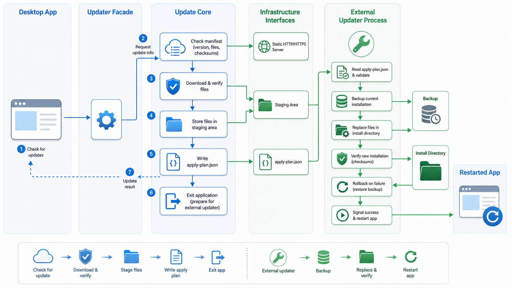

# libAutoUpdater Architecture and Implementation Plan

This document describes the target architecture, core modules, design tradeoffs, implementation phases, and acceptance criteria for `libAutoUpdater`.

The goal is a general-purpose, production-ready C++17 online update library for desktop applications on Windows, macOS, and Linux. Update files are hosted as static files over HTTP/HTTPS, without requiring a custom backend service.

## 1. Design Goals

`libAutoUpdater` targets desktop self-update scenarios.

Goals:

- Cross-platform support for Windows, macOS, and Linux.
- No GUI framework dependency in the core library.
- Replaceable network, hash, filesystem, signature, process launch, event dispatch, and persistence layers.
- Testable core decision logic with mocks and unit tests.
- Rollback after failed apply operations.
- Recovery path when a newly applied version is not confirmed healthy.
- Auditable structured artifacts: manifests, apply plans, state files, and transaction journals.
- Static-file release hosting.
- Security-first behavior: TLS verification, SHA-256 verification, manifest signatures, anti-downgrade, and anti-replay.

Non-goals for the first major implementation line:

- Binary patch generation.
- Built-in server implementation.
- Direct dependency on Qt, MFC, wxWidgets, Electron, or another GUI framework.
- Bypassing system package managers for package-manager-owned installations.

## 2. High-Level Architecture



The project is organized around the application-facing `Updater` facade, the update core, replaceable infrastructure interfaces, static update hosting, and the external updater process. File replacement is not performed inside the main application process. It is delegated to `autoupdater_apply`.

This avoids self-overwrite problems, especially on Windows where running executables and DLLs cannot be replaced directly.

## 3. Repository Structure

```text
libAutoUpdater/
  CMakeLists.txt
  cmake/
    libAutoUpdaterConfig.cmake.in

  include/
    libAutoUpdater/
      Updater.h
      Config.h
      Version.h
      Manifest.h
      ApplyPlan.h
      Error.h
      Result.h
      Types.h
      interfaces/
        INetworkClient.h
        IHashProvider.h
        IFileSystem.h
        ISignatureVerifier.h
        IEventDispatcher.h
        IProcessLauncher.h
        IStateStore.h

  src/
    Updater.cpp
    Version.cpp
    Manifest.cpp
    ApplyPlan.cpp
    ManifestFetcher.cpp
    ManifestVerifier.cpp
    LocalSnapshotBuilder.cpp
    UpdatePlanner.cpp
    DownloadExecutor.cpp
    ApplyPlanWriter.cpp
    ApplyLauncher.cpp
    util/
      PathUtil.cpp
      Json.cpp
      UrlUtil.h
    default/
      CurlNetworkClient.cpp
      WinHttpNetworkClient.cpp
      CfNetworkClient.cpp
      Sha256HashProvider.cpp
      StdFileSystem.cpp
      OpenSslSignatureVerifier.cpp
      NullSignatureVerifier.cpp
      DirectDispatcher.cpp
      ProcessLauncher.cpp
      JsonStateStore.cpp

  updater/
    main.cpp
    ApplyExecutor.h
    ApplyExecutor.cpp

  examples/
    cli/
    qt/
    update-server/

  tests/
  tools/
  docs/
```

## 4. Core Objects

### 4.1 Updater

`Updater` is the facade class normally used by applications.

Responsibilities:

- Manage the public state machine.
- Run background check and download tasks.
- Expose cancellation.
- Expose check results, progress, errors, and ready-to-apply callbacks.
- Coordinate manifest fetching, planning, downloading, apply-plan writing, and updater launch.
- Deliver callbacks through `IEventDispatcher`.

Typical usage:

```cpp
autoupdater::Config config = ...;
autoupdater::Updater updater(config);
updater.setCallbacks(callbacks);
updater.checkAndDownloadAsync();
```

State machine:

```text
Idle
  -> Checking
  -> UpToDate
  -> UpdateAvailable
  -> Downloading
  -> ReadyToApply
  -> Applying
  -> Failed
```

### 4.2 Version

`Version` parses and compares SemVer values.

Supported forms:

- `1.2.3`
- `1.2.3-alpha`
- `1.2.3-beta.1`
- `1.2.3+build.5`
- `1.2.3-alpha.1+build.5`

Comparison follows SemVer:

- `major`, `minor`, and `patch` are compared in order.
- A release version has higher precedence than a prerelease version.
- Build metadata does not affect precedence.

### 4.3 Manifest

The project uses two manifest types:

1. Index manifest
2. Release manifest

The index manifest routes by platform, architecture, and channel.

The release manifest describes a concrete release version, including files, removals, security metadata, and compatibility constraints.

This supports:

- Stable / beta / canary channels.
- Windows / macOS / Linux.
- x64 / arm64.
- Platform-specific pauses.
- Rollback releases.

### 4.4 UpdatePlanner

`UpdatePlanner` is a pure decision module and does not perform IO.

Inputs:

- Configuration snapshot.
- Current version.
- Remote manifest.
- Local file snapshot.
- Persisted state.

Outputs:

- Whether an update is available.
- Whether a full reinstall is required.
- Whether the update is mandatory.
- Files to download.
- Files to replace.
- Files to remove.
- Whether a downgrade is rejected.
- Whether an expired manifest is rejected.

Keeping the planner pure makes it easy to unit test without real networking or filesystem access.

### 4.5 DownloadExecutor

Responsibilities:

- Download files that are missing or whose local hash differs.
- Download into a staging directory.
- Mirror the installation layout under staging.
- Verify each downloaded file with SHA-256.
- Retry failures according to configuration.
- Support cancellation.
- Support resumable downloads.
- Report progress.

Resume metadata includes:

- ETag
- Last-Modified
- Content-Length
- Downloaded byte count

Resume requests use:

```http
Range: bytes=<offset>-
If-Range: "<etag>"
```

If ETag or Last-Modified no longer match, the partial file is discarded and the download restarts.

### 4.6 ApplyPlan

`ApplyPlan` is the only input consumed by the updater executable. The updater does not re-interpret the release manifest.

The apply plan is a transaction description, not just a file list.

It includes:

- `schemaVersion`
- `appId`
- `fromVersion`
- `toVersion`
- `manifestSha256`
- `installDir`
- `stagingDir`
- `backupDir`
- `restartCommand`
- `operations`

Operation types:

- `replace`
- `remove`

Future operation types may include `chmod`, `mkdir`, `rmdir`, and `symlink`.

### 4.7 StateStore

`IStateStore` persists updater state.

Stored data includes:

- Last successful version.
- Last accepted release ID.
- Pending healthy-confirmation version.
- Last failure reason.
- Rollback metadata.
- Download resume metadata.
- Anti-downgrade state.

The default implementation stores JSON under:

```text
install/.autoupdater/state.json
```

## 5. Manifest Design

### 5.1 Index Manifest

Example:

```json
{
  "schemaVersion": 1,
  "appId": "com.example.myapp",
  "channel": "stable",
  "generatedAt": "2026-06-01T10:00:00Z",
  "targets": [
    {
      "platform": "windows",
      "arch": "x64",
      "manifestUrl": "https://example.com/releases/1.4.0/windows-x64/manifest.json"
    },
    {
      "platform": "macos",
      "arch": "arm64",
      "manifestUrl": "https://example.com/releases/1.4.0/macos-arm64/manifest.json"
    }
  ]
}
```

`Config::manifestUrl` may point directly to a release manifest or to an index manifest. When it points to an index manifest, the client selects a matching target by `platform` and `arch`, then downloads the release manifest.

### 5.2 Release Manifest

Example:

```json
{
  "schemaVersion": 1,
  "appId": "com.example.myapp",
  "channel": "stable",
  "platform": "windows",
  "arch": "x64",
  "version": "1.4.0",
  "releaseId": "1.4.0+20260601.1",
  "releaseDate": "2026-06-01T10:00:00Z",
  "publishedAt": "2026-06-01T10:00:00Z",
  "expiresAt": "2026-07-01T00:00:00Z",
  "minVersion": "1.2.0",
  "minClientVersion": "1.0.0",
  "mandatory": false,
  "allowDowngrade": false,
  "notes": "Fix startup crash and improve sync performance.",
  "baseUrl": "https://example.com/releases/1.4.0/windows-x64/",
  "files": [
    {
      "path": "bin/MyApp.exe",
      "sha256": "9b3f...",
      "size": 18432000
    },
    {
      "path": "resources/app.dat",
      "localPath": "resources/app.dat",
      "sha256": "1a2b...",
      "size": 7340032
    }
  ],
  "remove": [
    "plugins/old_plugin.dll"
  ]
}
```

### 5.3 Path Rules

All manifest paths must satisfy:

- Use `/`.
- Be relative.
- Be non-empty.
- Not contain `..`.
- Not be absolute.
- Not contain a Windows drive prefix.
- Resolve inside `installDir` or `stagingDir`.

These rules prevent path traversal and accidental replacement of system files.

## 6. Apply Plan Design

Example:

```json
{
  "schemaVersion": 1,
  "appId": "com.example.myapp",
  "fromVersion": "1.3.0",
  "toVersion": "1.4.0",
  "releaseId": "1.4.0+20260601.1",
  "manifestSha256": "abc...",
  "installDir": "C:/Program Files/MyApp",
  "stagingDir": "C:/Program Files/MyApp/.autoupdater/staging/1.4.0",
  "backupDir": "C:/Program Files/MyApp/.autoupdater/backup/1.3.0-to-1.4.0",
  "restartCommand": [
    "C:/Program Files/MyApp/MyApp.exe"
  ],
  "operations": [
    {
      "type": "replace",
      "source": "bin/MyApp.exe",
      "target": "bin/MyApp.exe",
      "sha256": "9b3f...",
      "size": 18432000
    },
    {
      "type": "remove",
      "target": "plugins/old_plugin.dll"
    }
  ]
}
```

The updater executable executes the apply plan and writes a transaction journal:

```text
install/.autoupdater/journal/<transaction-id>.json
```

The journal records each completed step so interrupted operations can be inspected and future recovery logic can resume cleanup or rollback.

## 7. Update Flow

### 7.1 Check

```text
checkAsync()
  |
  v
validate config
  |
  v
download manifest bytes
  |
  v
download manifest signature if required
  |
  v
verify manifest signature
  |
  v
parse manifest
  |
  v
validate schema / appId / platform / arch / channel
  |
  v
build local snapshot
  |
  v
plan update
  |
  +-- up to date
  +-- update available
  +-- reinstall required
  +-- rejected
```

### 7.2 Download

```text
checkAndDownloadAsync()
  |
  v
check update
  |
  v
create staging dir
  |
  v
download changed or missing files
  |
  v
verify sha256
  |
  v
write apply-plan.json
  |
  v
ReadyToApply
```

### 7.3 Apply

```text
applyAndRestartAsync()
  |
  v
copy autoupdater_apply to staging and launch staged copy
  |
  v
main app exits
  |
  v
updater waits for pid
  |
  v
acquire update lock
  |
  v
backup affected files
  |
  v
execute operations
  |
  v
verify installed files
  |
  +-- success -> restart app
  +-- failure -> rollback -> report failure
```

### 7.4 Healthy Confirmation

Successful apply does not prove the new version works. After the updated application starts, it should call:

```cpp
updater.markCurrentVersionHealthy();
```

Flow:

```text
updater applied update
  |
  v
state = pending healthy confirmation
  |
  v
new app starts
  |
  v
markCurrentVersionHealthy()
  |
  v
clear backup / clear pending state
```

If the new version does not confirm health within the configured window, the next startup can prompt the user, roll back automatically, or enter safe mode.

## 8. Security Strategy

### 8.1 HTTPS

TLS certificate verification is enabled by default.

It can be disabled for tests:

```cpp
network.verifyTls = false;
```

Do not disable it in production.

### 8.2 File Integrity

Every file in the manifest must contain a SHA-256 digest.

After download:

```text
download file
  |
  v
sha256 downloaded file
  |
  +-- match -> accept
  +-- mismatch -> retry
  +-- retry exhausted -> fail
```

### 8.3 Manifest Signature

Production channels should require detached manifest signatures:

```text
manifest.json
manifest.json.sig
```

Verification flow:

```text
download manifest raw bytes
download signature bytes
verify raw bytes with public key
parse manifest only after signature passes
```

The signature file may be raw binary or base64 text. The release side can use `tools/sign_manifest.py`.

Benefits:

- Avoids JSON canonicalization problems.
- Works well on static servers.
- Prevents a compromised static server from creating a valid manifest.

### 8.4 Anti-Downgrade

Persist locally:

- `lastAcceptedVersion`
- `lastAcceptedReleaseId`

By default, manifests older than the accepted version are rejected. Downgrades should only be allowed when `allowDowngrade=true` and the manifest signature is valid.

### 8.5 Anti-Replay

The manifest may include:

- `publishedAt`
- `expiresAt`

The client rejects expired manifests. If the local system clock is clearly invalid, return a diagnostic error.

### 8.6 Download Source Restrictions

`Config` supports:

```cpp
std::vector<std::string> allowedBaseUrls;
```

Even after a signature passes, files may only be downloaded from trusted base URLs. If an index manifest is used, the selected release manifest URL is also checked.

## 9. Platform Strategy

### 9.1 Install Layout

Install layout enum:

```cpp
enum class InstallLayout {
    PortableDirectory,
    WindowsDirectory,
    MacOSAppBundle,
    LinuxAppImage,
    PackageManagerOwned
};
```

Initial focus:

- `PortableDirectory`
- `WindowsDirectory`
- Basic directory replacement for `MacOSAppBundle`

For `PackageManagerOwned`, self-update is rejected by default and the caller should direct users to the system package manager.

### 9.2 Windows

Considerations:

- Running `.exe` and `.dll` files cannot be overwritten directly.
- Use the external updater after the main process exits.
- Use wide-character filesystem APIs.
- Support long paths.
- Retry transient file locks.
- Report insufficient UAC privileges clearly.

### 9.3 macOS

Considerations:

- `.app` is a bundle directory.
- Code signature must remain valid after update.
- Preserve permissions and extended attributes where possible.
- Notarization and quarantine attributes require careful handling.

### 9.4 Linux

Considerations:

- Portable tarball and AppImage layouts are better suited for self-update.
- deb/rpm-managed software should not bypass the package manager.
- Preserve executable permissions after replacement.

## 10. Concurrency and Locking

Core library:

- A single `Updater` instance allows only one task at a time.
- Check and download can be cancelled.
- After cancellation, state returns to `Idle` or `Failed` with `Cancelled`.

Updater executable:

- Acquires a single-instance lock for the installation directory.
- Prevents two updater processes from replacing the same install at the same time.

Lock location:

```text
install/.autoupdater/update.lock
```

The current implementation uses an atomic lock directory. Future platform-specific implementations may use a Windows named mutex or POSIX `flock`.

## 11. CMake Targets

Exported targets:

```cmake
libAutoUpdater::libAutoUpdater
libAutoUpdater::autoupdater_apply
```

Build options:

```cmake
LIBAUTOUPDATER_BUILD_UPDATER=ON
LIBAUTOUPDATER_BUILD_EXAMPLES=ON
LIBAUTOUPDATER_BUILD_TESTS=ON
LIBAUTOUPDATER_WITH_CURL=ON
LIBAUTOUPDATER_WITH_OPENSSL=ON
LIBAUTOUPDATER_WITH_QT=OFF
```

Use after installation:

```cmake
find_package(libAutoUpdater CONFIG REQUIRED)
target_link_libraries(MyApp PRIVATE libAutoUpdater::libAutoUpdater)
```

Or as a subdirectory:

```cmake
add_subdirectory(external/libAutoUpdater)
target_link_libraries(MyApp PRIVATE libAutoUpdater::libAutoUpdater)
```

## 12. Test Plan

### 12.1 Unit Tests

Cover:

- SemVer parsing and comparison.
- Manifest parsing.
- Schema version validation.
- Platform / architecture / channel validation.
- `minVersion`.
- Mandatory updates.
- Anti-downgrade.
- Expired manifests.
- File-level diff planning.
- Remove operation generation.
- Path traversal rejection.
- Apply-plan serialization and deserialization.

### 12.2 Mock IO Tests

Use mock implementations of:

- `INetworkClient`
- `IFileSystem`
- `IHashProvider`
- `IStateStore`

Cover:

- Successful downloads.
- Download failure and retry.
- Hash mismatch and retry.
- Resumable downloads.
- Download cancellation.
- Manifest signature failure.

### 12.3 Integration Tests

Cover:

- Static manifest and file hosting.
- CLI example check and download.
- Updater executable replacing files in a temporary install directory.
- Rollback after apply failure.
- Removal of old files.

### 12.4 Platform Tests

Windows:

- Running executable replacement through updater.
- Unicode paths.
- Long paths.

macOS:

- `.app` bundle directory replacement.
- Permission preservation.

Linux:

- Executable permission preservation.
- Future symlink behavior.

## 13. Implementation Phases

### Phase 1: Foundation

Deliver:

- CMake project.
- Public headers.
- `Version`.
- `Result` / `Error`.
- Interface definitions.
- Basic test framework.

Acceptance:

- Project configures and builds.
- `VersionTests` pass.

### Phase 2: Manifest and Planner

Deliver:

- Release manifest parsing.
- Schema validation.
- Path validation.
- `LocalSnapshot`.
- Pure `UpdatePlanner`.

Acceptance:

- Detects up-to-date, update available, and reinstall required states.
- Generates replace and remove operation plans.
- Path traversal tests pass.

### Phase 3: Download and Verification

Deliver:

- `INetworkClient`.
- libcurl default implementation plus native WinHTTP and CFNetwork backends.
- `IHashProvider`.
- Default SHA-256 implementation.
- `DownloadExecutor`.
- Staging directory mirror.
- Retry, cancellation, and progress callbacks.

Acceptance:

- Downloads only files whose hashes differ or are missing.
- Retries on hash mismatch.
- Cancellation stops the flow.

### Phase 4: Apply Plan and Updater Executable

Deliver:

- Apply plan generation.
- External updater executable.
- Transaction journal.
- Backup, replace, remove, verify, and rollback.
- Single-instance lock.

Acceptance:

- A temporary install directory can be updated.
- Replacement failure rolls back.
- Remove operations take effect.

### Phase 5: Security

Deliver:

- Detached manifest signatures.
- OpenSSL verifier.
- `allowedBaseUrls`.
- Anti-downgrade.
- Anti-replay.

Acceptance:

- Invalid signatures reject updates.
- Expired manifests reject updates.
- Downgrade manifests are rejected by default.

### Phase 6: Examples, Tools, and Documentation

Deliver:

- CLI example.
- Qt example.
- `make_manifest.py`.
- README.
- Manifest examples.
- Apply plan examples.

Acceptance:

- A sample release directory can generate a manifest.
- CLI example can check, download, and schedule apply.
- README covers integration and release flow.

## 14. First Release Scope

Required:

- C++17 core library.
- Release manifest.
- SemVer.
- File-level incremental updates.
- SHA-256 verification.
- libcurl network implementation, plus native WinHTTP and CFNetwork HTTPS backends.
- External updater executable.
- Apply plan.
- Replace / remove operations.
- Rollback.
- CLI example.
- Packaging script.
- Unit tests.

Recommended:

- Detached manifest signatures.
- Anti-downgrade.
- Anti-replay.
- `allowedBaseUrls`.
- Healthy confirmation.

Deferred:

- Binary patching.
- Deep AppImage-specific flow.
- Deep macOS extended attribute handling.
- Gradual rollout policy.

## 15. Key Risks

### 15.1 Insufficient Permissions

System install directories may not allow replacement by a normal user.

Mitigation:

- Return explicit error codes.
- Document permission requirements.
- Add elevated helper support later if needed.

### 15.2 Broken macOS Code Signature

Replacing files inside a bundle may invalidate code signing.

Mitigation:

- Release artifacts should be signed as a whole.
- Optionally run `codesign --verify` after update as an external check.
- Document the constraint clearly.

### 15.3 Updating the Updater Itself

The updater executable cannot directly replace itself while running.

Mitigation:

- Do not update the running updater in the first version.
- A newly downloaded updater can take effect on the next update cycle.

### 15.4 Power Loss or Forced Termination

The apply process may be interrupted.

Mitigation:

- Record each step in a transaction journal.
- Detect incomplete transactions on the next start.
- Support rollback or cleanup.

## 16. Acceptance Criteria

The library should satisfy:

- A basic check integration requires no more than a few core lines of application code.
- No GUI dependency in the core library.
- Mock network and mock filesystem tests are possible.
- Static file servers can host updates.
- Downloads happen only for missing files or files whose hashes differ.
- Every downloaded file is verified by SHA-256.
- Unsupported manifest schemas fail gracefully.
- Local versions below `minVersion` return a reinstall-required result.
- The updater can safely replace files of a running application.
- Apply failure can roll back.
- Healthy confirmation can clear backups after a successful new-version start.
- CMake supports both `find_package` and `add_subdirectory`.
